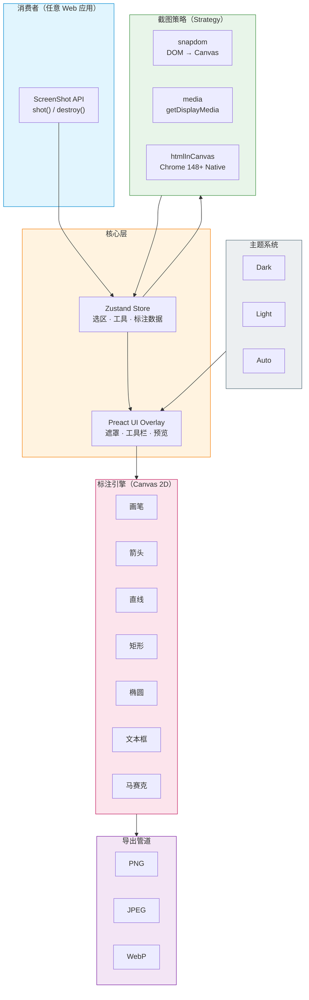

# js-screenshot 4+1 视图架构分析

基于 RUP（Rational Unified Process）4+1 Architectural View Model，由 Philippe Kruchten 提出。

## 1. 逻辑视图（Logical View）

> 系统提供什么功能？

- **ScreenShot 类**：SDK 入口，暴露 `shot()` / `destroy()` 两个核心 API
- **三种截图策略**：
  - `snapdom` — DOM 序列化为 Canvas 快照
  - `media` — 基于 `getDisplayMedia` 的屏幕录制捕获
  - `htmlInCanvas` — Chrome 148+ 原生 HTML→Canvas 能力
- **7 种标注工具**：画笔、箭头、直线、矩形、椭圆、文本框、马赛克
- **导出管道**：支持 PNG / JPEG / WebP 格式，可配置压缩质量
- **状态管理**：Zustand store 驱动选区、工具选择、标注数据等全流程状态

## 2. 开发视图（Development View）

> 代码如何组织？

- **UI 框架**：Preact（轻量替代 React，减小打包体积）
- **样式方案**：CSS Modules（样式隔离，避免全局污染）
- **构建工具**：Rollup，输出 ESM / CJS / IIFE 三种模块格式
- **类型系统**：TypeScript 全量覆盖
- **零外部依赖交付**：Preact、Zustand 等运行时依赖全部 bundle 进产物，消费者无需额外安装
- **主题系统**：Dark / Light / Auto 三套主题自适应

## 3. 进程视图（Process View）

> 并发、交互与性能表现

- **异步截图流程**：`shot()` 返回 Promise，用户选区 → 标注 → 保存全程异步交互
- **Canvas 渲染**：标注绘制基于 Canvas 2D API，主线程同步渲染
- **DOM 快照开销**：`snapdom` 模式下需遍历并序列化大量 DOM 节点到 Canvas
- **媒体捕获权限**：`media` 模式触发浏览器 `getDisplayMedia` 安全权限弹窗
- **自动资源清理**：截图完成或出错后自动调用 destroy，防止内存泄漏；也支持手动提前销毁

## 4. 物理视图（Physical View）

> 部署与运行环境

- **纯前端 SDK**：无服务端依赖，完全在浏览器端运行
- **分发方式**：
  - npm 包（ESM / CJS）— 适用于现代构建工具链
  - CDN / Script Tag（IIFE + CSS）— 适用于传统页面直接引入
- **浏览器兼容性**：`htmlInCanvas` 模式要求 Chrome 148+，其余两种模式兼容性更广
- **嵌入方式**：framework-agnostic，可嵌入任意 Web 应用

## 5. 场景视图（Scenarios）— "+1"

> 串联验证其他四个视图的核心用例

| 核心场景 | 涉及视图 |
|---------|---------|
| `shot()` → 弹出遮罩 → 拖拽选区 → 画笔标注 → 导出 PNG | 逻辑 + 进程 + 开发 |
| `<script>` 标签引入 IIFE 版本，在纯 HTML 页面中截图 | 物理 + 开发 |
| 切换 Dark / Light / Auto 主题，UI 自适应渲染 | 逻辑 + 开发 |
| 配置不同工具的默认颜色、线宽、字号 | 逻辑 + 开发 |
| 截图完成后自动销毁实例 vs 手动调用 `destroy()` 提前清理 | 进程 + 逻辑 |

## 架构总览图

## 架构亮点

- **极简 API**：仅 `shot()` + `destroy()` 两个方法覆盖全部功能
- **策略模式**：三种截图模式可插拔切换，扩展新捕获方式无需改动核心逻辑
- **零依赖交付**：消费者开箱即用，不污染宿主项目依赖树
- **轻量运行时**：Preact + Zustand 组合，bundle 体积极小
